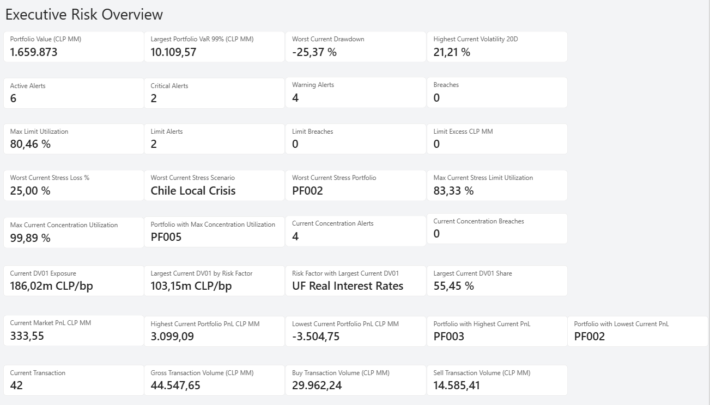
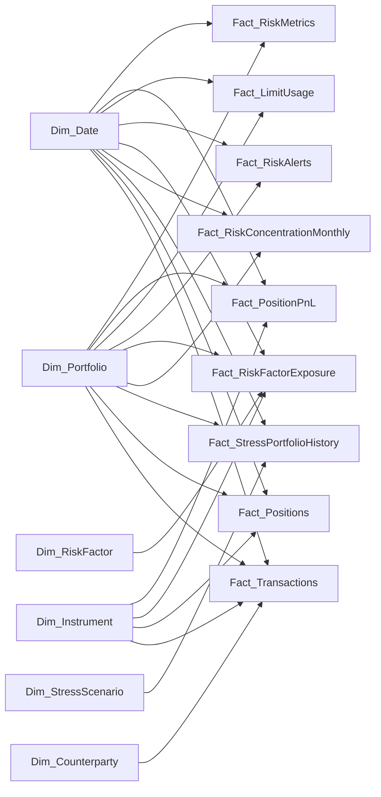

# Enterprise Market Risk Dashboard

Power BI dashboard for integrated **market risk monitoring, portfolio analytics, stress testing, concentration risk, risk-factor exposure, PnL, limits and transaction activity**.

## Project objective

The objective of this project is to provide an executive view of market risk across investment portfolios, bringing together key risk, performance and monitoring indicators in a single Power BI report.

The dashboard is designed to help identify:

- portfolio size and current market-risk profile;
- potential losses through VaR, volatility and drawdown;
- active alerts, limit utilization and breaches;
- stress-testing exposure under adverse scenarios;
- concentration risk by portfolio;
- interest-rate sensitivity through DV01;
- portfolio PnL and transaction activity.

## Executive Risk Overview



The main report page consolidates the following analytical blocks:

| Area | Key metrics |
|---|---|
| Portfolio & Market Risk | Portfolio Value, VaR 99%, Drawdown, Volatility 20D |
| Alerts | Active Alerts, Critical Alerts, Warnings, Breaches |
| Limits | Maximum Limit Utilization, Alerts, Breaches, Excess |
| Stress Testing | Worst Stress Loss, Worst Scenario, Worst Portfolio, Stress Limit Utilization |
| Concentration Risk | Maximum Concentration Utilization, Portfolio, Alerts, Breaches |
| Risk Factor Exposure | Current DV01, Largest DV01 by Risk Factor, Main Risk Factor, DV01 Share |
| PnL / Performance | Current Market PnL, Highest/Lowest Portfolio PnL |
| Transactions | Transaction Count, Gross Volume, Buy Volume, Sell Volume |

## Selected dashboard results

- **Portfolio Value:** 1,659,873 CLP MM
- **Largest Portfolio VaR 99%:** 10,109.57 CLP MM
- **Worst Current Drawdown:** -25.37%
- **Highest Current Volatility 20D:** 21.21%
- **Active Alerts:** 6
- **Current Breaches:** 0
- **Max Limit Utilization:** 80.46%
- **Worst Current Stress Loss:** 25.00%
- **Worst Stress Scenario:** Chile Local Crisis
- **Max Concentration Utilization:** 99.89%
- **Current DV01 Exposure:** 186.02m CLP/bp
- **Largest DV01 by Risk Factor:** 103.15m CLP/bp
- **Main DV01 Risk Factor:** UF Real Interest Rates
- **Current Market PnL:** 333.55 CLP MM
- **Current Transaction Count:** 42

## Data model

The solution uses a primarily **star-schema approach**, with shared dimensions connected to specialized fact tables. The diagram below is a simplified view of the core analytical model used by the dashboard.



### Main dimensions

- `Dim_Date`
- `Dim_Portfolio`
- `Dim_Instrument`
- `Dim_Counterparty`
- `Dim_RiskFactor`
- `Dim_StressScenario`

### Main fact tables

- `Fact_RiskMetrics`
- `Fact_Positions`
- `Fact_PositionPnL`
- `Fact_LimitUsage`
- `Fact_RiskAlerts`
- `Fact_RiskFactorExposure`
- `Fact_RiskConcentrationMonthly`
- `Fact_StressHistory`
- `Fact_StressPortfolioHistory`
- `Fact_Transactions`
- market-data and macroeconomic fact tables

The transaction model uses `Trade_Date_ID` as the active date relationship and `Settlement_Date_ID` as a secondary inactive relationship for settlement-date analysis when required.

## Tools and skills demonstrated

- Microsoft Power BI
- Power Query
- DAX
- Dimensional data modeling
- Star-schema design
- Data-type and locale validation
- Market risk analytics
- Value at Risk (VaR)
- Volatility and drawdown analysis
- Stress testing
- Limit monitoring
- Concentration risk
- DV01 / interest-rate sensitivity
- Portfolio PnL analytics
- Transaction analytics

## Key analytical interpretation

The dashboard currently shows **no active breaches**, while several indicators require monitoring. In particular, maximum concentration utilization is close to its limit, and adverse stress scenarios highlight portfolios with greater vulnerability. This allows the report to function not only as a reporting layer, but also as an executive risk-monitoring tool.

## Repository structure

```text
Enterprise-Market-Risk-Dashboard/
├── README.md
├── dashboard/
│   └── Enterprise_Market_Risk_Dashboard_FINAL.pbix
└── images/
    └── executive-risk-overview.png.png
```

## Notes

Before publishing Power BI files or source datasets, verify that the repository contains **no confidential, proprietary, credential or personally identifiable information**.

---

**Author:** Paulina Lobos  
**Project:** Enterprise Market Risk Dashboard  
**Platform:** Microsoft Power BI
